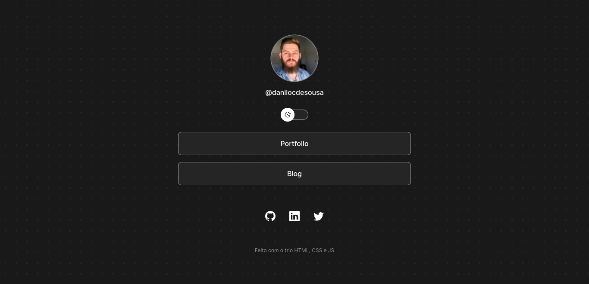
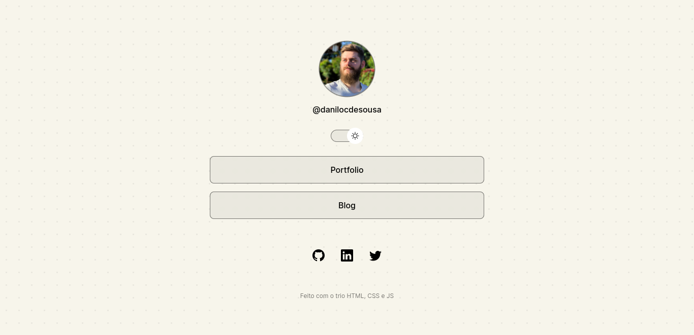

# DevLinks

Programa exclusivo e gratuito, promovido pela Rocketseat para ensino de tecnologias Web.

## Índice

<!--ts-->

- [Screenshots](#screenshots)
- [Tecnologias](#tecnologias)
- [Projeto](#projeto)
- [Pré-requisitos](#pré-requisitos)
- [Como usar](#como-usar)
- [Status](#status)
- [Contribuição](#contribuição)
- [Autor](#autor)
- [Licença](#licença)
<!--te-->

## Screenshots

- Dark mode

- Light mode

## Tecnologias

As seguintes ferramentas foram usadas no desenvolvimento do projeto:

- [HTML](https://developer.mozilla.org/en-US/docs/Web/HTML)
- [CSS](https://developer.mozilla.org/en-US/docs/Web/CSS)
- [JavaScript](https://developer.mozilla.org/en-US/docs/Web/JavaScript)
- [Figma](https://www.figma.com/)

## Projeto

O DevLinks é um agregador de links para usar como cartão de visitas online.

- [Repositório do projeto usado nas aulas](https://maykbrito.github.io/devlinks)

- [Assistir aulas](https://lp.rocketseat.com.br/devlinks/inscricao)

- [Projeto no Figma](https://www.figma.com/community/file/1187422022288947321)

## Pré-requisitos

Antes de começar, recomenda-se que você tenha as seguintes ferramentas instaladas em sua máquina:

- [VS Code](https://code.visualstudio.com/)
- [Git](https://git-scm.com)

## Como usar

Inicie o aplicativo no modo de desenvolvimento. Abra [http://localhost:3000](http://localhost:5500) para visualizá-lo em seu navegador.

## Status

Concluído ✅

## Contribuição

Pull requests não estão sendo aceitos no momento.

## Autor

Desenvolvido por [Danilo C. de Sousa](https://github.com/danilocdesousa)

## Licença

[MIT](https://choosealicense.com/licenses/mit/)
